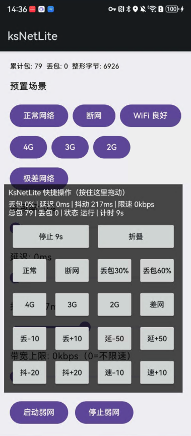

# KsNetLite

Android 弱网测试工具，支持浮窗一键切换弱网场景，适合功能回归、稳定性测试和线上问题复现。

## 亮点

- 浮窗快捷操作：正常、断网、4G、3G、2G、差网
- 丢包测试：快速切换 30% / 60%，并支持 +/-10 微调
- 延迟测试：支持 +/-50ms 快速调节
- 弱网参数：丢包、延迟、抖动、带宽整形
- 实时统计：总包数、丢包数
- 点击计时：每次点击浮窗按钮自动从 0 秒重新计时

## 功能列表

- 可拖动交互浮窗
- 一键恢复正常网络
- 一键断网
- 参数持久化保存
- 基于 `VpnService` 的弱网控制入口

## 代理模式说明

- 当前支持通过 SOCKS5 代理进行真实转发链路（用于非 Root 场景）
- 默认代理地址：`183.56.251.215:1080`
- 若代理不可达，弱网效果会退化或不可用，建议优先检查代理连通性

## APK 下载

- 本地 Debug 安装包：`./apk/ksnetlite-debug.apk`
- **高亮下载地址：**  
  **[`https://github.com/kekegdsz/ksNetLite/blob/main/apk/ksnetlite-debug.apk`](https://github.com/kekegdsz/ksNetLite/blob/main/apk/ksnetlite-debug.apk)**

## 演示截图

首页列表与浮窗联动演示：

## 当前架构

- `MainActivity`：首页控制台
- `KsNetVpnService`：VPN 前台服务和弱网处理循环
- `OverlayService`：浮窗交互入口
- `RuleEngine`：丢包判定与延迟计算
- `TrafficShaper`：带宽整形
- `TcpSessionManager` / `UdpProxy`：代理转发处理
- `ProfileStore` / `StatsStore` / `ServiceStateStore`：状态管理

## 适用场景

- 弱网回归测试
- 网络稳定性测试
- 故障复现（高丢包、高延迟、断网切换）

## 未来计划

- 指定 App 生效（白名单）
- 弱网配置导入导出
- 场景脚本化执行（时间轴）
- 更细粒度统计和日志
